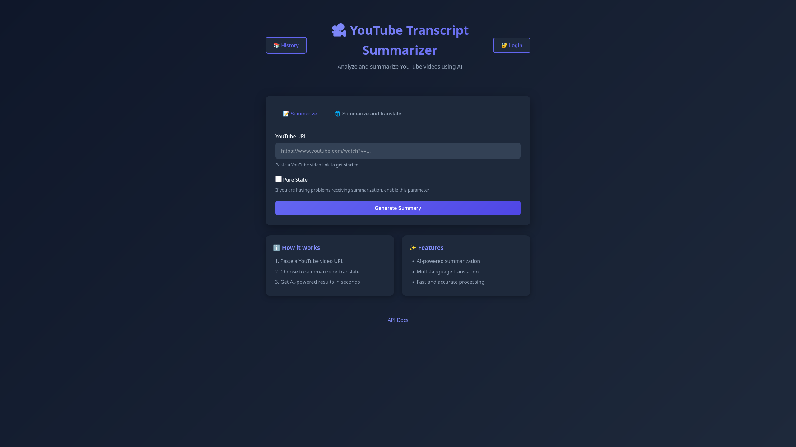
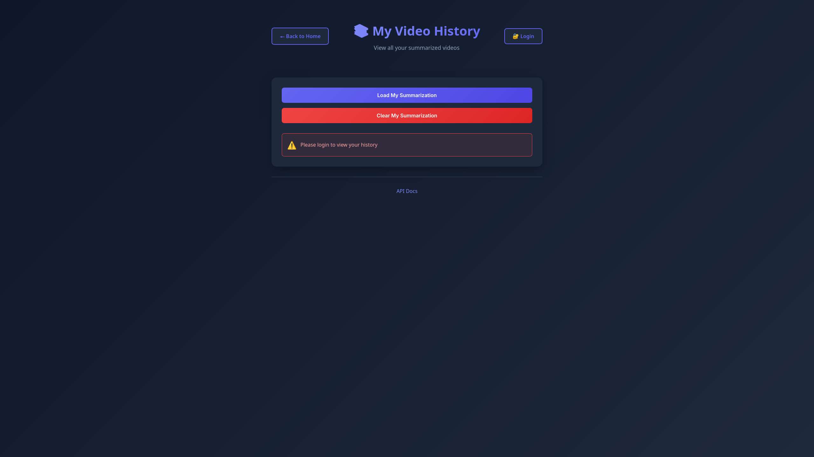
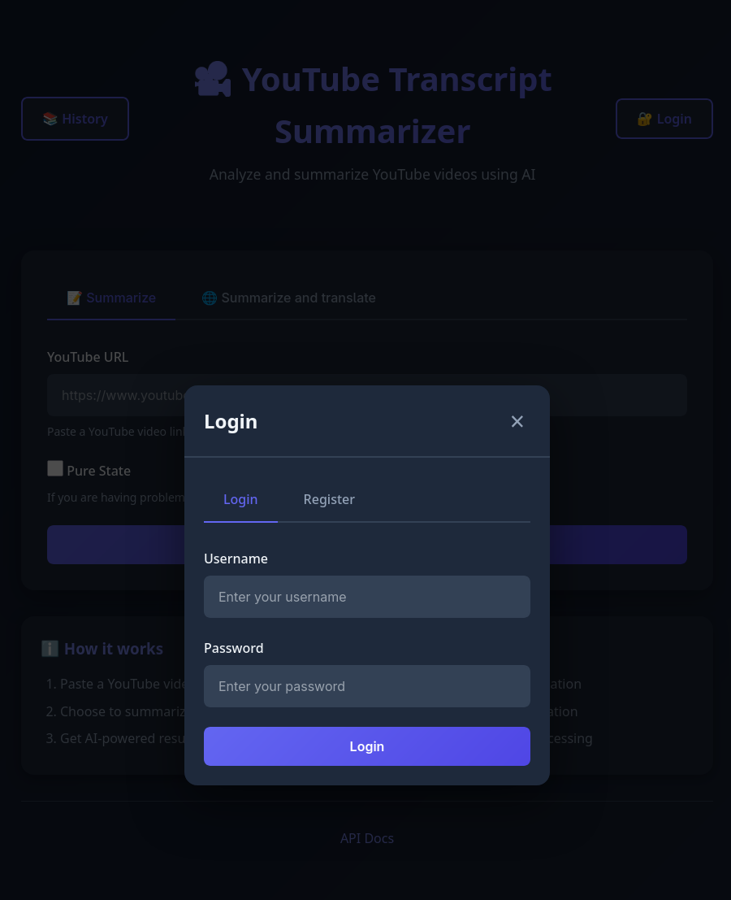
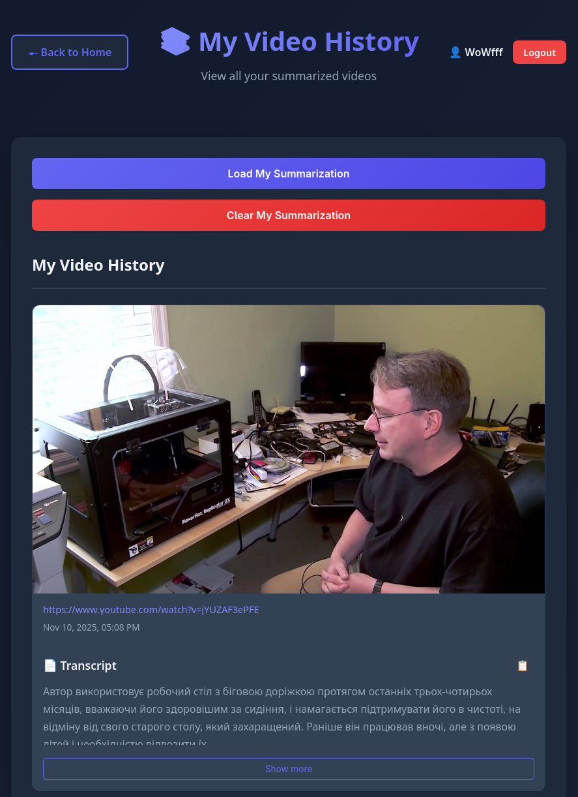
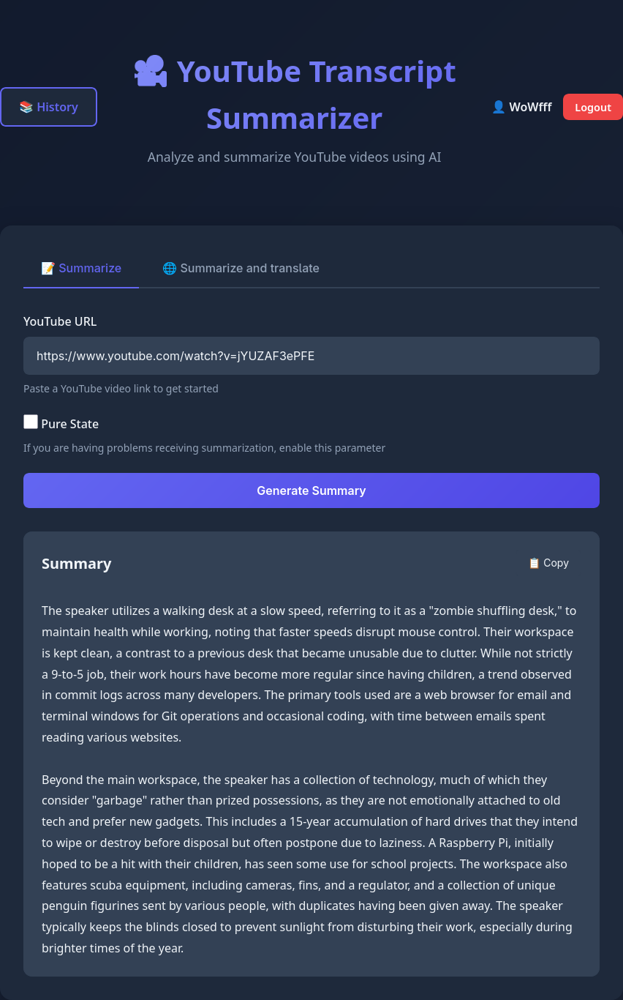
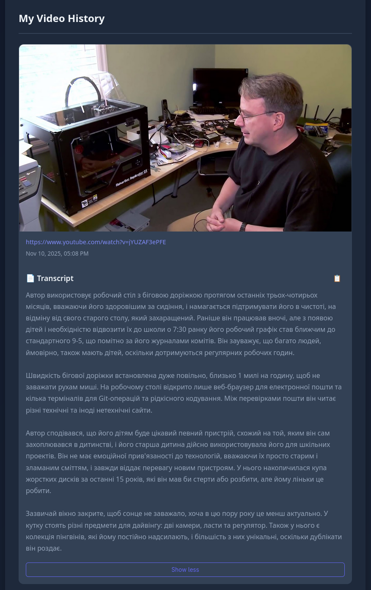

# 🎬 YouTube Transcript Summarizer

A modern web application that extracts, summarizes, and translates YouTube video transcripts using Google's Gemini AI. Built with FastAPI, PostgreSQL, and vanilla JavaScript.


## ✨ Features

- 🎥 **YouTube Video Processing** - Extract transcripts from any YouTube video (including Shorts)
- 🤖 **AI-Powered Summarization** - Generate concise summaries using Google Gemini AI
- 🌍 **Multi-Language Translation** - Translate and summarize transcripts in multiple languages
- 🔐 **User Authentication** - Secure JWT-based authentication with password hashing
- 📚 **Video History** - Save and manage your summarized videos
- 📄 **Transcript Viewing** - View full transcripts with expand/collapse functionality
- 🎨 **Modern UI** - Clean, responsive interface with smooth animations
- 🔒 **Secure** - HttpOnly cookies, bcrypt password hashing, and JWT tokens

## 📸 Screenshots

<table>
  <tr>
    <td width="33%"></td>
    <td width="33%"></td>
    <td width="33%"></td>
  </tr>
  <tr>
    <td></td>
    <td></td>
    <td></td>
  </tr>
</table>

## 🚀 Quick Start

### Prerequisites

- Python 3.13.7
- PostgreSQL 13 or higher
- Google Gemini API key ([Get one here](https://aistudio.google.com/api-keys))

### Installation

1. **Clone the repository**
   ```bash
   git clone https://github.com/WoWfff/youtube_transcript_sum.git
   cd youtube_transcript_sum
   ```

2. **Create a virtual environment**
   ```bash
   python -m venv .venv
   source .venv/bin/activate  # On Windows: .venv\Scripts\activate
   ```
   for uv
   ```bash
   uv venv
   source .venv/bin/activate
   ```

3. **Install dependencies**

   for pip (default)
   ```bash
   pip install -r requirements.txt
   ```
   for uv
   ```
   uv pip install -r requirements.txt
   ```

4. **Set up environment variables**
   
   Create a `.env` file in the root directory:
   ```env
   DB_HOST=localhost
   DB_PORT=5432
   DB_USER=your_database_user
   DB_PASS=your_database_password
   GEMINI_API_KEY=your_gemini_api_key
   JWT_SECRET_KEY=your-secret-key-change-this-in-production
   ```

5. **Create the database**
   
   Create a PostgreSQL database named `youtube_transcript`:
   ```sql
   CREATE DATABASE youtube_transcript;
   ```

6. **Initialize the database**
   
   The database tables will be created automatically on first run. Make sure your database connection settings in `.env` are correct.

7. **Run the application**
   Native Mode (Production Mode):
   ```bash
   fastapi run run.py
   ```
   Dev Mode (Development Mode):
   ```bash
   fastapi dev run.py
   ```

8. **Access the application**
   
   Open your browser and navigate to `http://127.0.0.1:8000`

## 📖 Usage

### Getting Started

1. **Register an account** - Click the "Login" button in the top-right corner and register a new account
2. **Summarize a video** - Enter a YouTube URL in the main page and click "Summarize"
3. **Translate a video** - Enter a YouTube URL, select a target language, and click "Translate"
4. **View history** - Click "History" in the top-left corner to see all your summarized videos
5. **View transcripts** - Click "Show more" on any video card to expand the full transcript

### Supported YouTube URL Formats

- Long URLs: `https://www.youtube.com/watch?v=VIDEO_ID`
- Short URLs: `https://youtu.be/VIDEO_ID`
- Shorts: `https://www.youtube.com/shorts/VIDEO_ID`

## 🏗️ Project Structure

```
youtube-transcript-summarizer/
├── app/
│   ├── configs/          # Configuration files
│   │   ├── app_config.py # Application settings
│   │   ├── config.json   # System instructions and languages
│   │   └── db_config.py  # Database configuration
│   ├── middleware/       # Custom middleware
│   │   └── user_tracking.py
│   ├── models/           # Data models
│   │   ├── db_models.py  # SQLAlchemy ORM models
│   │   └── pydantic_models.py # Pydantic request/response models
│   ├── routers/          # API route handlers
│   │   ├── auth.py       # Authentication endpoints
│   │   ├── summarizes.py # Summarization history endpoints
│   │   └── youtube.py    # YouTube processing endpoints
│   ├── services/         # Business logic
│   │   ├── database/     # Database operations
│   │   ├── summarizer.py # AI summarization service
│   │   ├── transcript.py # YouTube transcript fetching
│   │   └── user_sums_methods.py # User history management
│   ├── static/           # Frontend files
│   │   ├── index.html    # Main page
│   │   ├── history.html  # History page
│   │   ├── script.js     # Main page JavaScript
│   │   ├── history.js    # History page JavaScript
│   │   ├── auth.js       # Authentication JavaScript
│   │   └── styles.css    # Global styles
│   ├── summarizings/     # Generated summary files
│   ├── utils/            # Utility functions
│   │   └── jwt.py        # JWT token utilities
│   ├── dependencies.py   # FastAPI dependencies
│   └── main.py           # Application entry point
├── requirements.txt      # Python dependencies
├── run.py               # Application runner
└── README.md            # This file
```

## 🔧 API Endpoints

### Authentication

- `POST /auth/register` - Register a new user
- `POST /auth/login` - Login and receive JWT token
- `POST /auth/logout` - Logout and clear token
- `GET /auth/me` - Get current user information

### YouTube Processing

- `POST /url/` - Summarize a YouTube video transcript
- `POST /url/translate` - Translate and summarize a YouTube video transcript
- `GET /my_url/` - Get user's last saved URL
- `GET /my_urls/` - Get all user's saved URLs

### History

- `GET /summarizes/api` - Get all user's summaries (JSON)
- `DELETE /summarizes/api` - Clear all user's summaries

### Health

- `GET /health` - Health check endpoint

### Documentation

- `GET /docs` - Interactive API documentation (Swagger UI)
- `GET /redoc` - Alternative API documentation (ReDoc)

## 🔐 Security Features

- **Password Hashing** - All passwords are hashed using bcrypt before storage
- **JWT Tokens** - Secure token-based authentication
- **HttpOnly Cookies** - Tokens stored in HttpOnly cookies to prevent XSS attacks
- **Input Validation** - All inputs are validated using Pydantic models
- **SQL Injection Protection** - SQLAlchemy ORM prevents SQL injection
- **Error Handling** - Comprehensive error handling with appropriate HTTP status codes

## 🛠️ Technologies Used

### Backend
- **FastAPI** - Modern, fast web framework for building APIs
- **SQLAlchemy** - SQL toolkit and ORM
- **PostgreSQL** - Relational database
- **python-jose** - JWT token handling
- **passlib** - Password hashing
- **youtube-transcript-api** - YouTube transcript extraction
- **google-genai** - Google Gemini AI integration

### Frontend
- **Vanilla JavaScript** - No framework dependencies
- **HTML5** - Semantic markup
- **CSS3** - Modern styling with animations
- **Fetch API** - HTTP requests

## 📝 Environment Variables

| Variable | Description | Required |
|----------|-------------|----------|
| `DB_HOST` | PostgreSQL host | Yes |
| `DB_PORT` | PostgreSQL port | Yes |
| `DB_USER` | PostgreSQL user | Yes |
| `DB_PASS` | PostgreSQL password | Yes |
| `GEMINI_API_KEY` | Google Gemini API key | Yes |
| `JWT_SECRET_KEY` | Secret key for JWT tokens | Yes (change in production) |

## 🧪 Development

### Running in Development Mode

The application runs with auto-reload enabled by default:

```bash
fastapi dev run.py
```

### Code Style

This project uses `ruff` for code formatting and linting. Configuration is in `ruff.toml`.

### Database Migrations

Database tables are created automatically on first run. For production, consider using Alembic for migrations.

## 🤝 Contributing

Contributions are welcome! Please feel free to submit a Pull Request.

1. Fork the repository
2. Create your feature branch (`git checkout -b feature/AmazingFeature`)
3. Commit your changes (`git commit -m 'Add some AmazingFeature'`)
4. Push to the branch (`git push origin feature/AmazingFeature`)
5. Open a Pull Request

## 📄 License

This project is licensed under the MIT License - see the LICENSE file for details.

## 🙏 Acknowledgments

- [Google Gemini AI](https://deepmind.google/technologies/gemini/) for AI summarization
- [youtube-transcript-api](https://github.com/jdepoix/youtube-transcript-api) for transcript extraction
- [FastAPI](https://fastapi.tiangolo.com/) for the excellent web framework

## 📧 Contact

For questions or support, please open an issue on GitHub.

---

Made with ❤️ using FastAPI and Gemini AI
